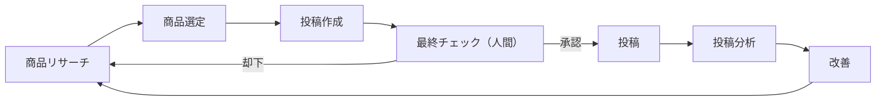

# roomiineforo — Threads × 楽天アフィリエイト自動化パイプライン

Threads投稿と楽天アフィリエイトの運用を、人間の最終チェックだけを残して自動化するためのパイプラインです。

## 全体フロー



| ステージ | 担当 | 実装 |
|---|---|---|
| 商品リサーチ | 自動 | `rakuten.py`: 楽天商品検索APIから候補商品を取得 |
| 商品選定 | 自動 | `selection.py`: レビュー評価・件数・価格帯・ジャンル重みでスコアリングし1件選定 |
| 投稿作成 | 自動 | `content.py`: 投稿文（フック＋商品情報＋アフィリエイトリンク）を生成 |
| 最終チェック | **人間** | `review.py`: 下書きは `pending_review` としてDBに保存。人間が内容を見て承認/却下する |
| 投稿 | 自動（承認後） | `threads_client.py`: Threads Graph APIへ投稿 |
| 投稿分析 | 自動 | `analytics.py`: いいね・返信・閲覧数などのインサイトを取得して記録 |
| 改善 | 自動 | `improve.py`: 分析結果から選定の重み（`data/weights.json`）を更新し、次のリサーチに反映 |

人間が担うのは「最終チェック」の承認/却下だけです。それ以外は定期実行（cron / GitHub Actions）で回します。

## セットアップ

```bash
pip install -r requirements.txt
cp .env.example .env  # APIキーを設定
python -m roomiineforo.cli init-db
```

`.env` を設定しない場合、楽天APIとThreads APIは自動的に **ドライラン（モックデータ）モード** で動作するので、鍵がなくてもパイプライン全体の動作確認ができます。

## 使い方（CLIコマンド）

```bash
# 1〜3: リサーチ→選定→投稿文作成 をまとめて実行し、下書きをレビュー待ちにする
python -m roomiineforo.cli run-cycle --keyword "ガジェット"

# 4: レビュー待ちの下書き一覧を見る（人間が確認するステップ）
python -m roomiineforo.cli review list

# 内容を見て承認 or 却下
python -m roomiineforo.cli review approve <draft_id>
python -m roomiineforo.cli review reject <draft_id> --reason "商品が微妙"

# 5: 承認済みの下書きをThreadsに投稿
python -m roomiineforo.cli publish

# 6: 投稿済みポストのインサイトを取得
python -m roomiineforo.cli collect-metrics

# 7: 分析結果から選定の重みを更新（次の商品リサーチに反映される）
python -m roomiineforo.cli improve
```

`review reject` された商品は除外リストに入り、次の `run-cycle` では再提案されません。承認されなかった／投稿しなかった商品も再度「商品リサーチ」からループに戻ります。

## 定期実行（GitHub Actions）

`.github/workflows/schedule.yml` に例を用意しています。

- `run-cycle` と `collect-metrics` / `improve` は完全自動でスケジュール実行
- `publish` は「人間が承認したものだけ」を対象にするため、承認後に自動実行されても安全（未承認の下書きは対象外）

人間のチェック作業（`review list` → `approve`/`reject`）は、ローカルCLIから行うか、CIログを見ながら手動でコマンドを実行してください。GitHub Issueベースの承認フロー（下書きをIssueとして起票し、コメントで `/approve` する）に拡張することも可能です。

**注意（状態の永続化）:** このパイプラインはSQLite（`data/roomiineforo.db`）に状態を持ちます。GitHub Actions上で運用する場合、ワークフローは `actions/cache` で `data/` を引き継ぐ簡易的な構成にしていますが、キャッシュは容量上限で削除されることがあり本番運用には不向きです。実運用では以下のいずれかを推奨します。

- 常時起動しているサーバー/VPSでcron実行し、SQLiteをローカルディスクに永続化する
- 外部DB（Supabase, PlanetScale等）に切り替える（`db.py` の接続部分を差し替えるだけで対応可能）

## データ

- `data/roomiineforo.db`: SQLite（products / drafts / posts / metrics）
- `data/weights.json`: 選定スコアリングの重み（改善ループで自動更新）
- `fixtures/sample_products.json`: APIキー未設定時に使うモック商品データ

## テスト

```bash
pytest
```

ネットワークに依存しない選定ロジック・投稿文生成ロジックをテストしています（楽天/Threads APIはモック）。
